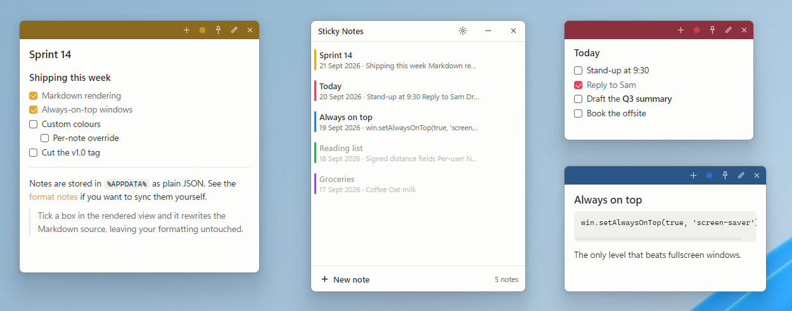
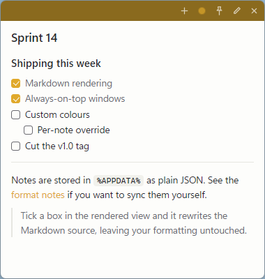
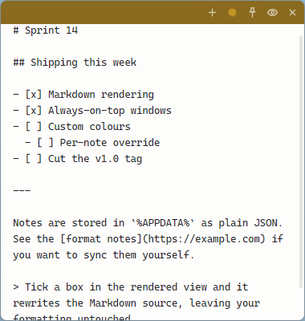
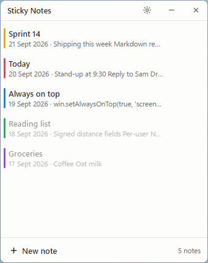
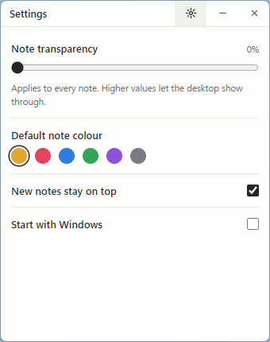
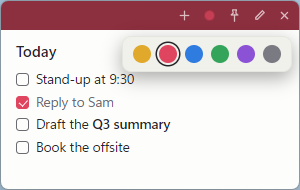

<div align="center">

# Sticky Notes

**Markdown sticky notes for Windows that stay above every other window.**

[](https://github.com/jcconsult/sticky-notes/releases/latest)
[](https://github.com/jcconsult/sticky-notes/releases)
[](https://github.com/jcconsult/sticky-notes/actions/workflows/ci.yml)
[](LICENSE)

[**Download for Windows**](https://github.com/jcconsult/sticky-notes/releases/latest) · [Features](#features) · [Screenshots](#screenshots) · [Development](#development)



</div>

---

Paste Markdown into a note and it renders. Tick a checkbox in the rendered view
and it writes straight back into the Markdown source, leaving your formatting
untouched. Pin any note above every other window and it stays there — including
over fullscreen apps.

No account, no sync, no subscription. Your notes are one JSON file on your disk.

## Features

- **Markdown rendering** — headings, lists, tables, code blocks, quotes, links.
  Paste from anywhere and it renders immediately.
- **Working checklists** — `- [ ]` items become real checkboxes. Ticking one
  rewrites a single line of the source, so nothing else about your text changes.
- **Always on top** — pin per note. Uses the window level that actually beats
  fullscreen windows, not the one that quietly loses to them.
- **Custom colours** — six-colour palette, one colour per note, so a wall of
  notes stays scannable.
- **Source view** — flip between rendered Markdown and the raw text with one
  click or `Ctrl+E`. Double-click a word in the rendered view and you land in
  the source with that word already selected.
- **Formatting toolbar** — select text while editing and a small toolbar
  appears: bold, italic, strikethrough, code, link, heading, checklist.
- **Hide notes** — press `F1` to hide every note and reach the app behind them;
  press again to bring them back. Hold the key instead to hide them only while
  it is held. Hidden notes can also come back on their own — after a spell
  without mouse or keyboard use, or after a set time even while you work — but
  never during a slideshow or full-screen app. Rebindable.
- **Widgets** — notes the app writes for you, in the same style. **Agenda**:
  today and tomorrow from your Google and Outlook calendars, with what's on now
  highlighted and a Join button for Teams, Meet and Zoom. **My issues** and
  **Triage** from Linear: what's on your plate, and what's waiting to be triaged.
- **All Notes** — every note in one list, open or closed. Reopen, close or
  delete from there.
- **Adjustable transparency** — let the desktop show through as much as you like.
- **Starts with Windows** — optional, lives in the tray.

## Install

Download the installer `.exe` from the
[releases page](https://github.com/jcconsult/sticky-notes/releases/latest) and
run it.

It is a per-user install, so it needs no administrator rights. It creates
desktop and Start Menu shortcuts, and uninstalls from **Settings → Apps** like
anything else. Uninstalling does not delete your notes.

> [!NOTE]
> The installer is not code-signed, so SmartScreen shows a warning the first
> time. Click **More info → Run anyway**. Signing requires a paid certificate.

**Requirements:** Windows 10 or 11, 64-bit.

## Screenshots

| Rendered | Markdown source |
| :--: | :--: |
|  |  |
| Checkboxes are live — tick one and the source updates. | One click, or `Ctrl+E`, switches between the two. |

| All Notes | Settings | Colours |
| :--: | :--: | :--: |
|  |  |  |

## Usage

Each note's title bar carries its controls:

| Control | Action |
| :--: | --- |
| `+` | New note |
| ● | Note colour |
| 📌 | Keep this note above other windows |
| ✎ / 👁 | Rendered view ↔ Markdown source |
| `✕` | Close the note — it stays in **All Notes** |

Right-click a note's title bar for duplicate, delete, and All Notes.

**The tray icon** (notification area, by the clock) opens **All Notes**, which
lists every note whether its window is open or not. Right-click it for a quick
menu including *Start with Windows*. While notes are hidden the icon fades,
and clicking it brings them back.

> [!TIP]
> On Windows 11 a new tray icon starts hidden under the `^` chevron. Drag it
> out onto the tray so it is always one click away.

**Settings** live behind the gear in the All Notes title bar, in groups:
**Appearance** (transparency, default colour), **Behaviour** (keep new notes
on top, start with Windows), **Hide notes**, **Connections** (accounts for
widgets) and **Keyboard**. Click **Change** next to the hide shortcut and press
the key or combination you want — if another app already owns it, it says so
instead of failing quietly. An F-key can be used on its own; while Sticky
Notes runs, other apps no longer receive it.

**Hide notes** reads as one sentence you tick parts of:

> Bring hidden notes back ☑ after *30 s* without mouse or keyboard use,
> ☐ after *10 min*, even if I'm still working,
> ☑ but not during a slideshow or full-screen app.

Screen sharing in Teams or Zoom in a normal window isn't detected — if you
share often, untick the first rule.

### Keyboard

| Shortcut | Action |
| --- | --- |
| `F1` | **Hide notes** — press to hide or show every note; hold to hide only while held (rebindable) |
| `Ctrl+N` | New note |
| `Ctrl+E` | Toggle rendered / source |
| `Ctrl+Enter` | Done editing — saves and shows the rendered view |
| `Ctrl+B` `Ctrl+I` `Ctrl+K` | Bold, italic, link (in the source view) |
| `Ctrl+V` | Paste Markdown — appends to the note and renders |
| `Esc` | Leave the source view |

Nothing needs saving — notes save as you type. `Ctrl+Enter` and `Esc` just
commit the edit and show you the result.

### Formatting

Select any text in the source view and a toolbar appears above it with
**B**, *I*, ~~S~~, `code`, link, heading and checklist. Every button toggles, so
pressing **B** on bold text unbolds it.

To format a word you can see in the rendered view, double-click it — that opens
the source with the word selected and the toolbar up, ready for `Ctrl+B`.

### Titles

Every note and widget can have a title in its title bar. **Double-click the
title bar** (or right-click → *Rename…*) to set or change it: `Enter` saves,
`Esc` cancels, and clearing it goes back to the default. A note with no title
shows a faint *Add title*; a widget shows its type's name until you rename it.
The title is what All Notes and the tray list the note by.

### Widgets

The **+** in any note or widget offers a new note or any widget type (`Ctrl+N`
is still an instant new note); All Notes and the tray have *New widget* too. A
widget looks and behaves like a note — colour, pin, transparency, title, `F1` —
but its text is written by the app, so it cannot be edited:

- a new widget opens on its **settings** — the ⚙ gear brings them back — where
  you choose what it shows, such as which calendars;
- the **footer** says how fresh it is; click it to refresh now;
- **right-click** for settings, rename, refresh, **Duplicate widget** (same
  settings, to change one thing), **Copy to note** (a frozen, editable copy),
  close and delete.

**Accounts are set up once, in All Notes → Settings → Connections**, and every
widget picks from them — several Agendas can share calendars, each showing its
own selection. A calendar added later appears in every Agenda until you untick
it there. Each connection shows whether it is working.

**Agenda** needs a calendar link:

| Calendar | Where the link is |
| --- | --- |
| Google | Settings → your calendar → **Integrate calendar** → *Secret address in iCal format* |
| Outlook | Settings → **Calendar → Shared calendars → Publish a calendar**, with *Can view all details* → the ICS link |

Each link is checked when you add it and refused, with the reason, if it does
not work, and the calendar is listed under its own name (*Work*, *Family*).
Google's *public* address only works for calendars shared with everyone — use
the secret one. Links are stored encrypted for your Windows
account in `%APPDATA%\sticky-notes\connections.json`, never in `notes.json`,
so a copied notes file carries no calendar access. Agenda refreshes every five
minutes, when Windows wakes or unlocks, and at midnight.

**My issues** and **Triage** need a Linear personal API key: in Linear,
**Settings → Account → Security & access → Personal API keys → New key**.
*Read* access is all they need. The key is checked when you add it, listed
under your workspace's name, and stored encrypted like calendar links.

- **My issues** — your open issues, grouped by status (or team, or priority)
  under each team's own status names, with urgent and due-today ones marked,
  due dates, and a link to any pull request. Optionally your backlog, and what
  you finished today.
- **Triage** — what's waiting in your teams' Triage, oldest first, with how
  long each has waited; ones waiting too long are marked.

Both tick which of your teams they show — a team you join later appears in
every widget until you untick it — and refresh every five minutes. Each fetch
is one or two requests, far inside Linear's limits.

### Where notes are stored

`%APPDATA%\sticky-notes\notes.json` — a single plain JSON file holding the
Markdown, colour, window position and pin state of every note, plus your
settings. Copy it to back up or move your notes between machines.

If the file is ever unreadable it is renamed aside rather than overwritten, so
a bad edit cannot cost you your notes.

## Development

```bash
git clone https://github.com/jcconsult/sticky-notes.git
cd sticky-notes
npm install
npm run dev
```

`npm run dev` runs your checkout as **Sticky Notes (dev)** — a separate app
with a purple tray icon that runs beside an installed copy, so there is nothing
to quit first. It keeps its own data in `%APPDATA%\sticky-notes-dev`, starting
from a copy of your real notes on first run; your real notes file is never
written. `npm run dev:reset` discards that copy (quit the dev app first).

| Script | What it does |
| --- | --- |
| `npm run dev` | Run the checkout beside the installed app, on a copy of your notes |
| `npm run dev:reset` | Throw the dev copy away; the next `dev` run copies your notes again |
| `npm start` | Run the checkout as the real app, on your real notes (quit the installed one first) |
| `npm run check` | Parse every source file |
| `npm test` | Run the formatting, hide-shortcut, widget, extension-contract, Linear and migration tests |
| `npm run pack:dir` | Package to `dist/win-unpacked` without an installer |
| `npm run dist` | Build the installer into `dist/` |

### Layout

```
src/main/main.js          windows, tray, settings — all OS-facing behaviour
src/main/store.js         the JSON file, debounced and written atomically
src/main/hide.js          the hide shortcut: tap, hold, and when notes return
src/main/presenting.js    is a slideshow or full-screen app running? (Windows)
src/main/migrations.js    versioned, one-time upgrades of notes.json
src/main/connections.js   accounts of every type; secret fields encrypted
src/main/widgets/         the widget framework — knows no integration
  registry.js               what extensions contribute, and the settings rules
  runtime.js                fetch schedule, minute redraw, host, action tables
  format.js                 rows → Markdown; the one place widgets are styled
src/main/extensions/      integrations, one folder each
  index.js                  the list of built-in extensions
  calendar/                 calendar links (connection) + Agenda (widget)
  linear/                   Linear API key (connection) + My issues, Triage
src/preload/              the IPC bridges: a note, a widget, and All Notes
src/renderer/note.js      one note window
src/renderer/widget.js    one widget window: content, settings, footer
src/renderer/fields.js    forms drawn from schemas: widget settings, Connections
src/renderer/titlebar.js  the title in the title bar, renamed in place
src/renderer/markdown.js  markdown-it plus the checkbox/source round-trip
src/renderer/format.js    Markdown formatting operations on the textarea
src/renderer/library.js   the All Notes list and Settings
src/shared/palette.js     colours and themes, shared by main and renderers
tools/make-icon.js        draws build/icon.ico, so no binaries are committed
```

No bundler and no frontend framework — plain HTML, CSS and JavaScript on
Electron. `markdown-it` is vendored into `src/vendor/` at install time so the
sandboxed renderer can load it as a script. The main process loads two
dependencies from `node_modules`: `ical.js` (Mozilla's iCalendar parser) and
`koffi` (a foreign-function library with prebuilt binaries, for the one
Windows call Electron doesn't expose — only its Windows x64 binary is
packaged).

#### Adding an integration

An integration is one folder in `src/main/extensions/`, listed in
`extensions/index.js`, exporting a manifest that contributes two kinds of
thing:

```js
module.exports = {
  id: 'calendar', name: 'Calendar',
  connections: [{                  // accounts → Settings → Connections
    type: 'ics', name: 'Calendars', noun: 'calendar', multiple: true,
    fields: [{ key: 'url', label: 'Calendar link', type: 'url', secret: true }],
    check: async (values, host) => ({ label, detail }),   // test it, name it
  }],
  widgets: [{                      // widget types → the + menu
    type: 'agenda', name: 'Agenda', color: 'blue', icon: 'calendar',
    uses: ['ics'], refreshMinutes: 5,
    settings: [{ key: 'calendars', label: 'Calendars', type: 'connections', of: 'ics' }],
    fetch: async (settings, host) => data,
    view: (data, settings, now) => ({ sections: [/* rows */], summary, glance }),
  }],
};
```

Widget settings come in four field types: `toggle`, `choice`, `connections`
(which accounts of a type to use) and `checklist` (which of a list the
widget's own data supplies — Linear's teams — via `options(data)`). Both lists
store what is *unticked*, so something new appears everywhere until someone
unticks it. Only a change of connections fetches again; every other setting
only redraws, so a widget fetches everything its settings can show and lets
them filter — changes are instant. `icon` names one of the app's own
icons (`registry.ICONS`), and `glance` — `{ value, caption, badge?, live? }` —
is the one-look summary a widget will show as a tile in a group.

The framework does the rest: it draws Settings → Connections from
`connections`, draws each widget's settings from `settings` and validates every
value, shows *nothing connected* / *nothing selected* / *couldn't load* the
same way for every widget, and formats `view`'s rows into Markdown. Extensions
never build UI or write Markdown — that is what keeps every widget consistent.

A widget touches the world only through `host`: `host.fetch(url, options?)`
(with `{ method, headers, body }` for an API such as Linear's GraphQL),
`host.connections(type)` (only the connections it has ticked, decrypted) and
`host.report(id, error)` (a connection's health). Built-in widgets use exactly
this contract, and `test/extensions.test.js` checks every extension against
it. That is also the boundary third-party widgets would need — though loading
them is not built: code in the main process can reach everything, so it would
need a sandboxed process first.

### Details worth knowing

- **Always on top** uses `setAlwaysOnTop(true, 'screen-saver')`. The plain
  `setAlwaysOnTop(true)` default silently loses to fullscreen windows.
- **Checkbox toggles** rewrite one line of the source using the line number
  `markdown-it` records on each token, rather than re-serialising the document
  from its parse tree. That is what keeps your formatting intact.
- **Formatting edits** go through `document.execCommand('insertText')`, which
  is deprecated but is the only way to change a textarea's value while keeping
  Chromium's native undo stack. `setRangeText()` silently destroys it.
- **Hide notes** rides on the fact that Windows repeats a held hotkey:
  Electron's `globalShortcut` has no key-up event, so repeats arriving means
  the key is held, and a gap in them stands in for the release. A press with
  no repeats is a tap. The logic lives in `src/main/hide.js`, free of Electron,
  so `test/hide.test.js` plays out taps, holds and idle time on a fake clock.
- **Hidden notes come back** on idle time (`powerMonitor.getSystemIdleTime()`)
  or, with the time limit, only at the first two-second pause in input after
  it — so they never reappear under a click. While presenting they stay
  hidden: `src/main/presenting.js` asks Windows the same question it asks
  before showing a notification (`SHQueryUserNotificationState` — a slideshow,
  full-screen app or game), through `koffi`. If that can't load, the rule does
  nothing rather than break.
- **Upgrades migrate data once.** `notes.json` carries a `version`; at startup
  `src/main/migrations.js` runs each newer migration in order, after copying
  the original to `notes.json.v<N>.bak`, and writes the current shape. The
  rest of the app only ever sees the current shape — no compatibility code
  outside that file. `test/migrations.test.js` covers each one.
- **Toggle keys can't be the shortcut.** Registering Caps Lock, Num Lock or
  Scroll Lock as a hotkey still flips the lock, so they are not offered; F12 is
  reserved by Windows for debuggers.

### Security

Renderers run sandboxed with `contextIsolation` enabled and no Node access.
`markdown-it` runs with `html: false`, so pasted content cannot inject markup.
Links are opened by the main process, and only `http`, `https` and `mailto`.

Widget text comes from other people (calendar invites, issue titles), so it is escaped by
the formatter and rendered without linkify: only the formatter makes links,
and each is an opaque id whose target stays in the main process. Join buttons
are made only for Teams, Meet and Zoom addresses. A widget window's preload
cannot write its content, and the main process refuses to if asked.

## Releasing

Releases are cut by tagging. CI does the rest — builds the installer on a
Windows runner and publishes it to a GitHub Release with generated notes.

```bash
npm version patch      # or minor / major — bumps package.json and tags
git push --follow-tags
```

Watch it at [Actions → Release](https://github.com/jcconsult/sticky-notes/actions/workflows/release.yml).

## License

[MIT](LICENSE) © Jonathan Cummins
